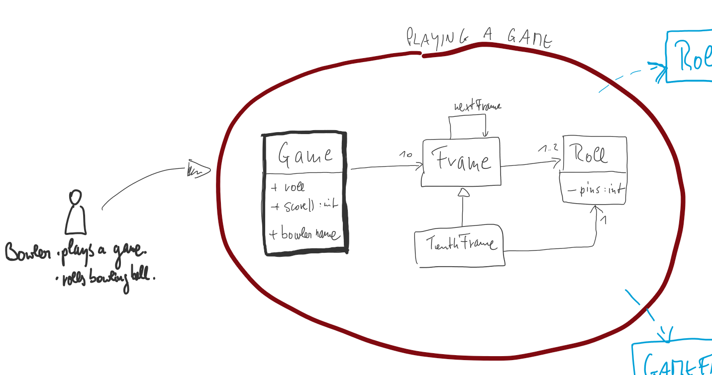

# A DDD Approach to Uncle Bobs Bowling Kata
We used the BowlingKata from Uncle Bob which is OO only and extended the code with 2 new features in a DDD approach.
   
Here you see the approach from Uncle Bob  
http://butunclebob.com/ArticleS.UncleBob.TheBowlingGameKata   
  
  
Someone asked:   
  _"Why is the design so different from the implementation?"_
  
Uncle Bob said:  
  _"Excellent question! It's because we could not see how simple the solution really was when we drew that design!"_ 
 
Uncle Bob had 1 bounded context if you will:
  

# 2 new features 
This extension adds to Uncle Bobs approach a 
 * Hall Of Fame
 * Running Scoreboard  

# Progress
My thinking and progress can be monitored via the commit messages and here [Notes-Development-Approach.md](Notes-Development-Approach.md).
